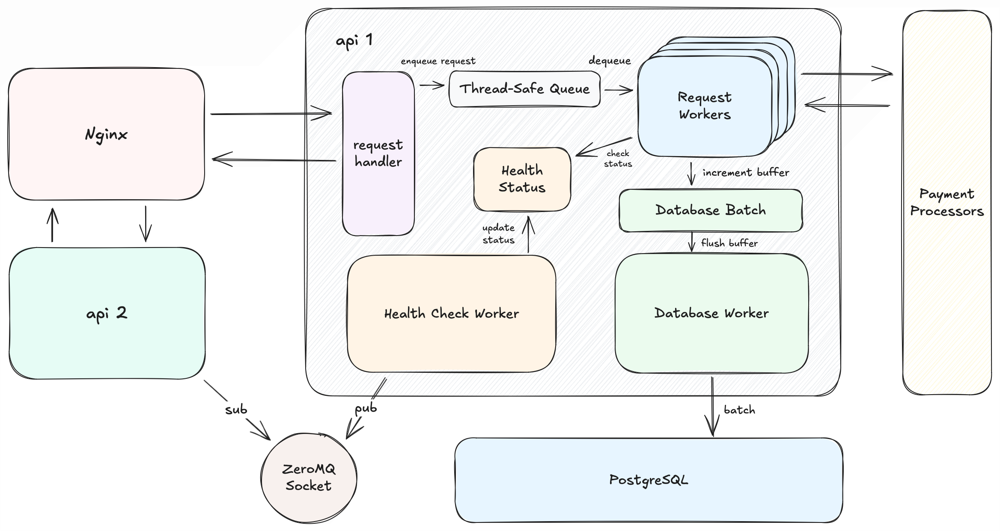

# 📦 rinha-2025-hael

API desenvolvida para a **Rinha de Backend 2025**, implementada na minha linguagem Hael, uma linguagem interpretada, cujo interpretador foi escrito em Go.

Meus mais sinceros agradecimentos ao Lucas Laurentino (3o colocado na Rinha) pelo artigo que ele fez sobre a sua participação na Rinha, explicando a sua abordagem e as tecnologias que usou. Eu pedi permissão dele para copiar boa parte da sua estratégia, para tornar possível (e mais performática) a submissão na minha linguagem Hael.
Dito isso, a maior parte do System Design, tecnologias e arquivos de configuração eu me baseei na submissão dele, fiz modificações para melhorar a performance e se adequar ao meu caso de uso, mas sem ele, talvez eu não tivesse tido o mesmo sucesso nesse projeto. Obrigado!


##  Linguagem Hael

A Linguagem Hael possui um interpretador escrito em Go, ele possui um lexer (identifica e cria os tokens), um parser (cria objetos com os tokens e constrói a Abstract Source Tree), e um evaluator (avalia os objetos e executa).

##  Arquitetura Geral

Para essa edição, o desafio era processar milhares de requisições de pagamentos, manter a consistência entre o payment processor e o processor da API, usando apenas 1,5 CPU e 350MB de RAM, além de necessitar de pelo menos duas cópias da API, tudo isso rodando em containeres Docker. Pra tornar isso possível, era necessário fazer uma alocação inteligente e distribuir bem os recursos para otimizar o máximo possível. 

Minha arquitetura final ficou com 2 instâncias da API, 1 Load Balancer Nginx, e 1 Banco de Dados PostgreSQL, como visto na figura a seguir:


##  Arquitetura Interna da API

Olhando a arquitetura interna da API, há 4 partes principais: 
- Request Handler: recebe a requisição, adiciona ela na fila, e retorna o mais rápido possível
- Request Workers: retira itens da fila, processa eles, e adiciona no buffer para envio ao DB.
- Database Worker: faz o flush do buffer, fazendo o batch no DB. 
- Health Check Worker: verifica o estado da API, e envia o resultado para as outras cópias do serviço. 

A comunicação entre réplicas é feita através do ZeroMQ, o serviço Main executa o health-check, e faz o pub do melhor payment processor a ser usado, os outros serviços fazem sub desse tópico e atualizam de acordo com o andar dos testes. Para retirar o overhead do protocolo TCP, isolei o socket do ZeroMQ em um volume do Docker, e os serviços se comunicam através de IPC, um protocolo de comunicação inter-processos, significativamente mais rápido. Essa é uma estratégia que foi utilizada também para a comunicação com o PostgreSQL, o socket foi isolado num volume para maior velocidade.



## Request Handler

O Request Handler é o ponto de entrada da aplicação, ele é quem recebe as requisições. A ideia aqui é que a resposta seja enviada o mais rápido possível, e para isso, ao receber a requisição, o handler adiciona ela a uma queue de processamento, e em seguida já retorna uma resposta bem-sucedida.

## Request Workers

Os Request Workers são os responsáveis por processar a queue de pagamentos. A quantidade de workers pode ser alterada, mas na minha versão final eu mantive 30 workers, foi o que me trouxe mais resultados. Cada worker desenfileira um item da queue (uma chan em Go, uma fila thread-safe), verifica o melhor processor para pagamento, envia para o payment processor e então, adiciona ele num buffer que posteriormente será enviado para o Banco de dados.

## Database Worker

O Database Worker é responsável por fazer o batch de pagamentos para o banco de dados da aplicação. É um worker que a cada 1 segundo, esvazia o buffer de pagamentos e os envia para o banco de dados. Essa abordagem me permitiu reduzir (em muito) a quantidade de conexões necessárias para o banco de dados (já que só era utilizada uma por réplica da aplicação) e também reduzir os recursos necessários para rodar o PostgreSQL, que agora recebia 2 requisições (apesar de com muitos dados) por segundo. Como mencionei no tópico da Arquitetura, a comunicação com o Postgres foi feita através de um socket em um volume compartilhado com os serviços da API.

## Health Check Workers

O Health Check Worker faz requisições a cada 5 segundos para o Payment Processor, verifica qual o melhor processador e atualiza o estado interno do serviço, enquanto também publica para as outras réplicas terem dados atualizados. Aqui há uma diferença entre as réplicas, para evitar que sejam feitas várias requisições. Eu informo ao serviço se ele é o "main" através de variáveis de ambiente. Somente o Main faz as requisições e publica, os outros dão sub no tópico e apenas atualizam internamente. A comunicação é feita através do socket ZeroMQ.

## Alocação de Recursos

Como eu falei no começo, me baseei na submissão do Lucas, então eu comecei seguindo a mesma alocação de recursos, porém eu estava tendo muuuuuitos problemas de performance, já que eu tenho um overhead de interpretação da minha linguagem. Dito isso, algumas modificações minhas também permitiram reduzir cpu e memória alocadas para o banco de dados, o que me deu mais performance para a aplicação. Dito isso, o resultado final foi:
- 2 cópias da aplicação, cada uma com 0.5 CPU e 80MB de RAM.
- Servidor Nginx, com 0.2 CPU e 60MB de RAM.
- Instância do PostgreSQL, com 0.3 CPU e 130MB de RAM.

Totalizando assim os 350MB de RAM e 1.5 de CPU.

## 🚀 Como rodar

### Localmente
```sh
docker compose up -d --build
````

### Arquitetura ARM
```sh
docker compose -f docker-compose-arm64.yml up -d --build
````

